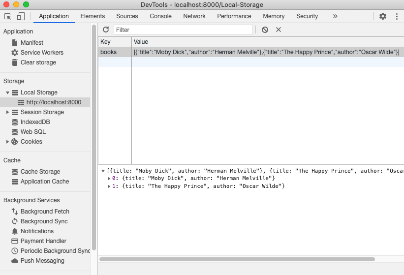
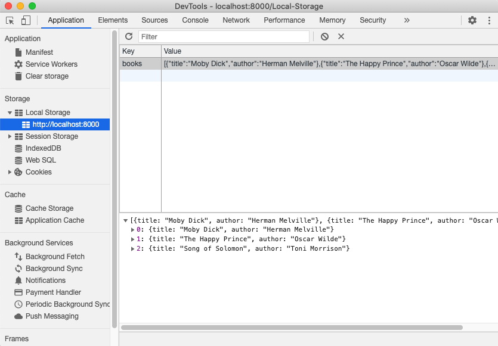

<div style="margin: 2rem auto;">
    
</div>

Sometimes a full database and user authentication is overkill for a particular application. What if there was an easy way to maintain data for the current user and not have to build out a database?

###Accessing the localStorage object

<a href="https://developer.mozilla.org/en-US/docs/Web/API/Window/localStorage">Window.localStorage</a> is a built in property of the document's origin. It is an object that can store string values for any number of given keys.

For example, if we wanted to keep track of a list of books, we first create the array of objects. To save it to local storage, we need to convert it into a string using <a href="https://developer.mozilla.org/en-US/docs/Web/JavaScript/Reference/Global_Objects/JSON/sringify">JSON.stringify()</a> and use the <a href="https://developer.mozilla.org/en-US/docs/Web/API/Storage/setItem">setItem()</a> method to create a new 'key' in the local storage object named 'books'.

```javascript
const myBooks = [
  {
    title: "Moby Dick",
    author: "Herman Melville",
  },
  {
    title: "The Happy Prince",
    author: "Oscar Wilde",
  },
]

localStorage.setItem("books", JSON.stringify(myBooks))
```

To see the current state of local storage, we can use DevTools. For Chrome, go to Application - Storage - Local Storage and you will be able to see a table of key/value pairs currently saved.

<div style="margin: 1rem auto;">
    
</div>

We can see that the key "books" has been created where the value is our book list represented by a string.

The data stored here will be here after the browser is refreshed or closed. It will remain saved until the browser's cache and history is cleared.

To retrieve the current list of books from local storage, we could just use <a href="https://developer.mozilla.org/en-US/docs/Web/API/Storage/getItem">getItem()</a>, but that would return a string. If we want to work with the data, we proably want to convert it back to an array of objects.

We can use <a href="https://developer.mozilla.org/en-US/docs/Web/JavaScript/Reference/Global_Objects/JSON/parse">JSON.parse()</a> to re-create an object. Here, we get the data from local storage and save it as a variable.

```javascript
let currentList = JSON.parse(localStorage.getItem("books"))
```

At some point we may want to add to the list. Once the current list is parsed from local storage, we can treat it like an normal javascript array. We can add new book to the array using the <a href="https://developer.mozilla.org/en-US/docs/Web/JavaScript/Reference/Global_Objects/Array/push">.push()</a> method. From there, the array is then used to reset the "books" object in local storage.

```javascript
const newBook = {
  title: "Song of Solomon",
  author: "Toni Morrison",
}
currentList.push(newBook)
localStorage.setItem("books", JSON.stringify(currentList))
```

We can confirm the list has been updated by using the DevTools window.

<div style="margin: 1rem auto;">
    
</div>

The local storage object is a handy way to persist data during and after the current user's session. It is stored in the browser's cache for that particular domain and will remain until the history is cleared.
