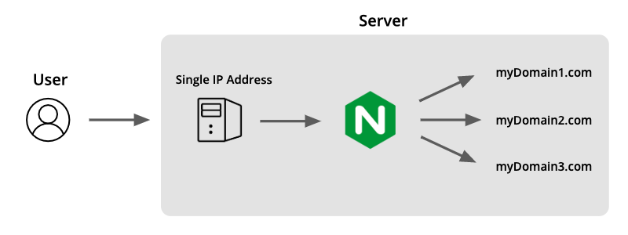
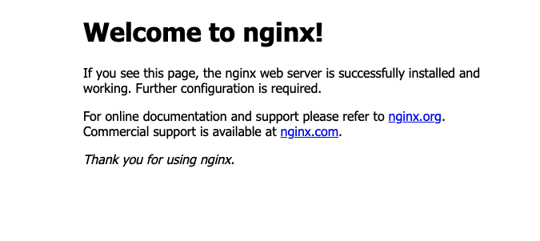

<div style="margin: 2rem auto;">
    
</div>

Nginx is a web server that can be used to set up hosting for multiple websites on a single server instance. I use this on my own Linux server for project work. Whenever I have a new project or need to show something to a client, I just add another server block and I'm up and running.

If you have a running server, and multiple domain names, you can point them all to the server's IP address and let Nginx to the rest.

<div style="margin: 1rem auto;">
    
</div>

###Step 1: Create User

If you already have a user set up with admin privileges, skip to step 2.

The root user has unrestricted access to just about everything on the server. So, it's a good idea to create a more restricted account to prevent accidental changes and only have root privileges when necessary.

Let's create a new user. It will ask you to choose a password and enter optional user information.

```javascript
$ adduser emily
```

We can make Emily a superuser so she can perform administrative actions using the 'sudo' prefix. Here, we use '-aG' to add Emily to the sudo group.

```javascript
$ usermod -aG sudo emily
```

Depending on how your Linux distribution is set up, you may not have the 'sudo' command installed. To check run \$ sudo -h and you should see a list of options for the 'sudo' command. If you get an error, you will need to install it.

```javascript
$ apt-get install sudo
```

Now that we have 'sudo' installed, we can switch to our new user account, and move on to setting up Nginx.

```javascript
$ su emily
```

###Step 2: Nginx Installation

To get started, you'll need to make sure you have Nginx installed

```javascript
$ sudo apt-get update
$ sudo apt-get install Nginx
```

If you're server has a firewall configured, you will need to reconfigure it to allow access for Nginx. If not, you can skip this step.

Here we have the option to allow Nginx traffic on HTTP (port 80), HTTPS (port 443), or both. If you have not configured a TLS/SSL certificate, use 'HTTP'.

```javascript
$ sudo ufw allow 'Nginx HTTP'
```

Nginx should now be up and running. If you visit your server's address in a browser, you will see the Nginx landing page.

<div style="margin: 2rem auto;">
    
</div>

###Step 3: Configure Nginx

Nginx can now direct incoming traffic to the appropriate location on the server based on the requested domain name. For each site, there will be a folder for the site's root directory, and a configuration file.

The configuration files will be located in /etc/nginx/sites-available, and the site folders will be located in /var/www/.

Nginx comes with a default configuration file that routes all incoming traffic to /var/www/html. If we take a look at the file we can see how that is handled.

```javascript
server {
        listen 80 default_server;
        listen [::]:80 default_server;  // listen to all requests

        root /var/www/html;   // serve this folder

        index index.html index.htm index.nginx-debian.html;  // look for these files

        server_name _;

        location / {
                try_files $uri $uri/ =404;  // send a 404 error if no file found
        }
}
```

Let's first create a root directory for our first domain.

```javascript
$ mkdir -p /var/www/myDomain1.com
```

Next we can create an index.html as a placeholder for our site.

```javascript
$ sudo nano /var/www/myDomain1.com/index.html
```

```html
<html>
  <h1>My Domain 1</h1>
  <p>This is our first domain</p>
</html>
```

Now that we have something to serve, we need to create our configuration file for the domain. We will start by copying the we the existing 'default' configuration file that we looked at before and change some of the settings.

Since this will no longer be the default location, we can remove the reference to 'default\_server'. The root directory will be the new folder we made in /var/www/ and the 'server\_name' will be the new domain name.


```javascript
$ sudo cp /etc/nginx/sites-available/default /etc/nginx/sites-available/myDomain1.com
$ sudo nano /etc/nginx/sites-available/myDomain1.com
```

```javascript
server {
        listen 80 ;       // remove default server designation
        listen [::]:80 ;    // ..

        root /var/www/myDomain1.com;   // update for the new domain

        index index.html index.htm index.nginx-debian.html;

        server_name myDomain1.com www.myDomain1.com;

        location / {
                try_files $uri $uri/ =404;
        }
}
```

Once the configuration file is created, we will need to enable the new server block. This is accomplished by creating a symbolic link:

```javascript
$ sudo ln -s /etc/nginx/sites-available/myDomain1.com /etc/nginx/sites-enabled/
```

Then, check for any configuration errors, and restart Nginx to let our updates take affect.

```javascript
$ sudo nginx -t
$ sudo systemctl restart nginx
```

We can now navigate to 'myDomain1.com' and should see our index.html page.

<div style="margin: 1rem auto;">
    
</div>

Sweet! We now have our first working server block!

###Next...

To add additional server blocks for more domains, just repeat Step 3 for each new domain. Be sure to restart Nginx after any configuration changes in order for them to take effect.

It's also important to note that the existing 'default\_server' configuration file will remain active.  If any request comes to the server that does not match one of our configured domains, then Nginx will send the request to the default html file we saw earlier.