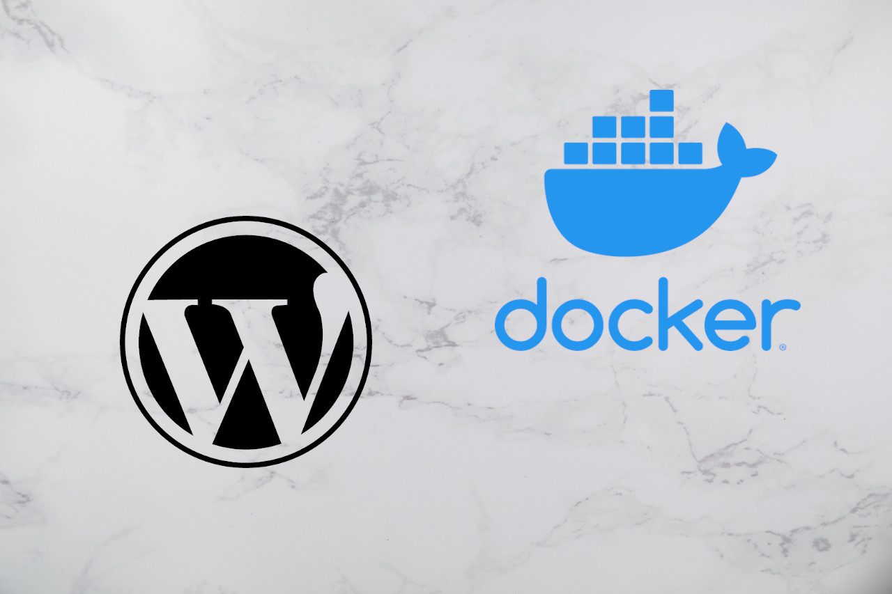

<div style="margin: 2rem auto;">
    
</div>

###Overview

There are a number of ways to set up a local development environment for Wordpress.  In the past, it usually meant setting up and running an entire MAMP or WAMP server, creating a database, then installing Wordpress.

Docker offers an alternative that allows you to set up everything you need with a single configuration file and start command.  It also has the benefit of consuming far less system resources.

In the following, I'll step you through basic example to get a development environment up and running.

If you don't currently have docker installed, you can download the source file <a href="https://docs.docker.com/desktop/">here</a> for your specific operating system.

###Configuration with YAML

The docker configuration file is where the magic happens.  It's a set of instructions to tell docker exactly what we want to set up and run.  For a wordpress site, we will need to setup a container for the SQL database, and another for the actual Wordpress instance.

Docker Compose is a tool that allows us to set up and run multiple Docker containers at one time.  Configuration is done in YAML format.  What is YAML you ask?  

YAML Ain't Markup Language.  

No, seriously that's the actual <a href="https://yaml.org">acronym</a>.   

We'll start out with an empty project directory with a docker-compose.yml file.

A basic example for a Wordpress site would look like this:

```YAML
services:
  db:
    image: mysql:5.7
    volumes:
      - db_data:/var/lib/mysql 
    restart: always
    environment:
      MYSQL_ROOT_PASSWORD: password
      MYSQL_DATABASE: wordpress
      MYSQL_USER: admin
      MYSQL_PASSWORD: 123456
  wordpress:
    depends_on:
      - db
    image: wordpress:latest
    ports:
      - "8000:80"
    restart: always
    volumes:
      - wp_data:/var/www/html
    environment:
      WORDPRESS_DB_HOST: db:3306
      WORDPRESS_DB_USER: admin
      WORDPRESS_DB_PASSWORD: 123456
volumes:
  db_data:
  wp_data:
```

With this type of file, indentation is critical.  Top level elements must be all the way to the left, and each lower-level item must be indented to the right.  

The 'services' section defines each container to be created and configured options.  The 'volumes' section will list our persistent data storage items, which we'll look at in a minute.  

Let's take a closer look at the database configuration:

```YAML
  db:
    image: mysql:5.7  # multiple versions available
    volumes:    # db_data maps to directory in container
      - db_data:/var/lib/mysql  
    restart: always   
    environment:
      MYSQL_ROOT_PASSWORD: password
      MYSQL_DATABASE: wordpress
      MYSQL_USER: admin
      MYSQL_PASSWORD: 123456
```

We first define an image for Docker to use.  In this case, we will use mySQL version 5.7.

Then, we define a volume key for the database.  This tells docker to store the container data on our local machine and re-mount it to the container whenever it is started again.  This will maintain the database and any changes we make even if the container stopped and restarted.  

We add a restart option which tells docker to always try to restart the container if it ever shuts down unexpectedly.

The database will need credentials which we can define under the environment option.

For the wordpress configuration, the process is similar.  We'll need to use the same database credentials that we specified earlier:

```YAML
  wordpress:
    depends_on:  # will wait for database startup before connecting
      - db    
    image: wordpress:latest     # multiple versions available
    ports:
      - "8000:80"     # local port 8000 is mapped to port 80 on the container
    restart: always
    volumes:    # wp_data maps to directory in container
      - wp_data:/var/www/html
    environment:
      WORDPRESS_DB_HOST: db:3306    # default port for database
      WORDPRESS_DB_USER: admin
      WORDPRESS_DB_PASSWORD: 123456
```


###Starting Docker

Open a terminal in the project directory and starting up the containers is as easy as:

```javascript
$ docker-compose up
```
We can add a '-d' option to run them as a background service.  I would recommend running without it initially so you can view the log output in case there are any errors.

We can now visit http:\\\localhost:8000 to access the site.

<div style="margin: 2rem auto;">
    
</div>

To stop the containers, we use:

```javascript
$ docker-compose down
```

Since we added our wp\_data and db\_data to 'volumes', any site updates we made will persist on our local machine the containers will stay up to date if and when they are restarted.

That's it! We now have a single configuration file that we can use to spin up a wordpress site in seconds.

###Bonus:  Adding phpMyAdmin

Once we have our site up and running, we can add phpMyAdmin to provide access to the database.  In the docker-compose.yml file we'll need to add another service:

```YAML
  phpmyadmin:
    depends_on:
      - db
    image: phpmyadmin/phpmyadmin
    restart: always
    ports:
      - "8080:80" #8080 on local machine maps to 80 on the container
    environment:
      PMA_HOST: DB
      MYSQL_ROOT_PASSWORD: password
      UPLOAD_LIMIT: 300M    # default file size is 10M
```

We also need to add and additional option to each of our 3 services.  

```YAML
    networks:
      - wpsite   # name it anything
```

Each container is now part of a specific docker network that we've named 'wpsite'.  We'll also need to add this network as a top-level item.  

The network and data volumes have to be established and mapped first, so it won't work on the initial docker startup.

We can now visit http:\\\localhost:8080 to access phpMyAdmin.

The final docker-compose file:

```YAML
services:
  db:
    image: mysql:5.7
    volumes:
      - db_data:/var/lib/mysql 
    restart: always
    environment:
      MYSQL_ROOT_PASSWORD: password
      MYSQL_DATABASE: wordpress
      MYSQL_USER: admin
      MYSQL_PASSWORD: 123456
    networks:
      - wpsite

  phpmyadmin:
    depends_on:
      - db
    image: phpmyadmin/phpmyadmin
    restart: always
    ports:
      - "8080:80" #8000 on local machine maps tso 80 on the container
    environment:
      PMA_HOST: DB
      MYSQL_ROOT_PASSWORD: password
      UPLOAD_LIMIT: 300M
    networks:
      - wpsite

  wordpress:
    depends_on:
      - db
    image: wordpress:latest
    ports:
      - "8000:80"
    restart: always
    volumes:
      - wp_data:/var/www/html
    environment:
      WORDPRESS_DB_HOST: db:3306
      WORDPRESS_DB_USER: admin
      WORDPRESS_DB_PASSWORD: 123456
    networks:
      - wpsite

networks:
  wpsite:
  
volumes:
  db_data:
  wp_data:
```

<div style="margin: 1rem auto;">
    
</div>

####Reference Docs:
<a href="https://github.com/compose-spec/compose-spec/blob/master/spec.md">Docker Compose Specification</a> 

<a href="https://hub.docker.com/search?q=&type=image">Docker - Available Images</a>

